# Hyac - A Lightweight Python Cloud Function (FaaS) Platform

<p align="right">
  <a href="./README.md">简体中文</a>
</p>

<div align="center">
  
</div>

> [!WARNING]
> **This project is in the early development stage.**
>
> - Features and APIs may undergo significant changes.
> - Direct deployment to a production environment may pose unknown risks and issues.
> - The project architecture may be adjusted and refactored in the future.
>
> Feedback and contributions are welcome, but please use it with caution in a production environment.

## 🖼️ Preview

<div align="center">
  
</div>

[](LICENSE)

## 📖 Introduction

**Hyac** is a powerful full-stack Function as a Service (FaaS) platform designed to provide an efficient, scalable, and user-friendly cloud-native development environment. It allows developers to quickly deploy, manage, and execute serverless functions, greatly simplifying the workflow from development to production.


## 🌐 Online Access

- **Project Demo**: https://console.hyacos.top
  - Default username: `admin`, Default password: `admin123`
- **Project Documentation**: https://docs.hyacos.top
## ✨ Key Features

- 🚀 **Dynamic Function Execution**: Dynamically load and execute function code in isolated Docker containers.
- 🔥 **Hot Code-Swapping**: Real-time updates of function code without service restarts.
- 🌐 **Multi-language Support**: Extensibility based on runtimes allows for future support of multiple programming languages.
- 💻 **Modern Frontend**: Built with Vue 3 and Naive UI, providing a responsive, user-friendly management interface.
- 📦 **Unified Object Storage**: Integrated with MinIO to provide unified file storage for functions and applications.
- 🔗 **Comprehensive API**: Offers a rich set of APIs for managing applications, functions, databases, logs, etc.

## 🏛️ System Architecture

Hyac adopts a microservices architecture based on Docker Compose, where various components work together to form an efficient FaaS ecosystem.

```mermaid
graph TD
    subgraph "👨‍💻 User End"
        U[User]
    end

    subgraph "🏗️ Infrastructure"
        T[Traefik]
        DB[(MongoDB)]
        S[(MinIO)]
    end

    subgraph "⚙️ Backend Services"
        Server[Server]
        App[App]
    end

    subgraph "🎨 Frontend Service"
        Web[Web]
    end

    U -- HTTPS --> T
    T -- Routes by domain --> Server
    T -- Routes by domain --> Web
    T -- Routes by domain --> S
    
    Server -- Manages --> App
    Server -- Reads/Writes --> DB
    Server -- Reads/Writes --> S
    
    App -- Executes Function --> App
    App -- Reads/Writes --> DB
    App -- Reads/Writes --> S

    Web -- API Requests --> Server
```



- **`traefik`**: Acts as a reverse proxy and load balancer, handling all external requests and automatically routing them to the `server`, `web`, or `minio` services based on the domain.
- **`server`**: The core backend service, responsible for business logic, API routing, user authentication, and FaaS application management.
- **`app`**: The function executor service, which dynamically executes user-defined functions in an isolated environment.
- **`web`**: A Vue 3-based frontend application that provides the user interface.
- **`mongodb`**: Serves as the primary database, storing core data such as applications, functions, and users.
- **`minio`**: Used for object storage, for instance, to store function code, dependencies, or other files.

## 🛠️ Tech Stack

- **Backend**: Python 3.10+, FastAPI, Beanie (Motor), Loguru
- **Frontend**: Vue.js 3, Vite, Naive UI, Pinia, UnoCSS, TypeScript
- **Database & Storage**: MongoDB, MinIO
- **Containerization**: Docker, Docker Compose

## 🚀 Getting Started

### ✅ Prerequisites

- [Docker](https://www.docker.com/get-started)
- [Docker Compose](https://docs.docker.com/compose/install/)

### ⚙️ Installation & Configuration

1.  Clone the project locally:
    ```bash
    git clone https://github.com/your-repo/hyac.git
    cd hyac
    ```

2.  Configure environment variables:
    Copy the `.env.example` file and rename it to `.env`, then modify the configurations according to your environment.

### ▶️ Starting the Services

Execute the following command to build and start all services:

```bash
docker-compose up -d
```

### 🌐 Access Points

- **Frontend Application**: `http://localhost:80`
- **MinIO Console**: `http://localhost:9001` (Default username/password: `minioadmin`/`minioadmin`)

## 📁 Major Project Structure

```
.
├── app/            # Function Executor Service
├── server/         # Core Backend Service
├── web/            # Frontend Application (Vue 3)
├── nginx/          # Nginx Configuration
├── docker-compose.yml # Docker Compose Configuration
├── ...
├── ...
├── ...
└── .env            # Environment Variables
```

## 📈 Star History

[](https://star-history.com/#Pidbid/Hyac&Date)


## 📜 Changelog

- [简体中文](./changelog/CHANGELOG.zh-CN.md)
- [English](./changelog/CHANGELOG.md)

## ️ Roadmap

We plan to add more powerful features in future versions to build a more complete, enterprise-grade FaaS platform.

For a detailed overview of future features, architectural enhancements, and improvement plans, please see our [Feature Roadmap (FEATURES.en.md)](./FEATURES.en.md). Community contributions and suggestions are welcome!

## 🤝 Contributing

We welcome contributions of all forms! If you have great ideas or find issues, please feel free to submit a Pull Request or Issue.

## 📄 License

This project is open-sourced under the [MIT License](LICENSE).
