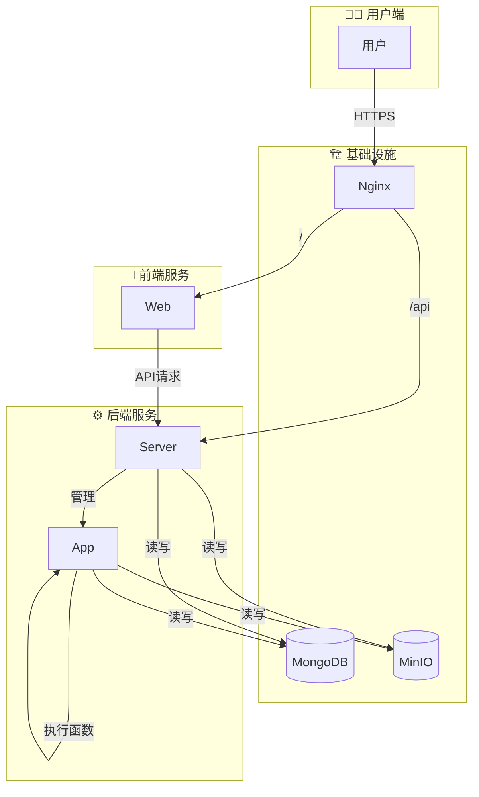

# Hyac - 轻量级Python函数计算与应用平台

<p align="right">
  <a href="./README.en.md">English</a>
</p>

<div align="center">
  
</div>

> [!WARNING]
> **当前项目处于早期开发阶段**
>
> - 功能和 API 可能会发生较大变化。
> - 直接部署用于生产环境可能会存在未知的风险和问题。
> - 项目架构在后期可能会进行调整和重构。
>
> 欢迎提供反馈和贡献，但请谨慎用于生产环境。

## 🖼️ 预览

<div align="center">
  
</div>

[](LICENSE)

## 📖 介绍

**Hyac** 是一个功能强大的全栈函数即服务 (FaaS) 平台，旨在提供一个高效、可扩展且易于使用的云原生开发环境。它允许开发者快速部署、管理和执行无服务器函数，极大地简化了从开发到生产的流程。

## ✨ 主要功能

- 🚀 **动态函数执行**: 在隔离的 Docker 容器中动态加载和执行函数代码。
- 🔥 **代码热更新**: 无需重启服务即可实现函数代码的实时更新。
- 🌐 **多语言支持**: 基于运行时的可扩展性，未来可以支持多种编程语言。
- 💻 **现代化前端**: 基于 Vue 3 和 Naive UI 构建，提供响应式、用户友好的管理界面。
- 📦 **统一对象存储**: 集成 MinIO，为函数和应用提供统一的文件存储服务。
- 🔗 **全面的 API**: 提供丰富的 API，用于管理应用、函数、数据库、日志等。

## 🏛️ 系统架构

Hyac 采用基于 Docker Compose 的微服务架构，各组件协同工作，形成一个高效的 FaaS 生态系统。



- **`nginx`**: 作为反向代理，处理所有外部请求，并根据路径将其路由到 `server` 或 `web` 服务。
- **`server`**: 核心后端服务，负责业务逻辑、API 路由、用户认证和 FaaS 应用管理。
- **`app`**: 函数执行器服务，在隔离的环境中动态执行用户定义的函数。
- **`web`**: 基于 Vue 3 的前端应用，提供用户交互界面。
- **`mongodb`**: 作为主数据库，存储应用、函数、用户等核心数据。
- **`minio`**: 用于对象存储，例如存放函数代码、依赖或其他文件。

## 🛠️ 技术栈

- **后端**: Python 3.10+, FastAPI, Beanie (Motor), Loguru
- **前端**: Vue.js 3, Vite, Naive UI, Pinia, UnoCSS, TypeScript
- **数据库与存储**: MongoDB, MinIO
- **容器化**: Docker, Docker Compose

## 🚀 快速开始

### ✅ 环境准备

- [Docker](https://www.docker.com/get-started)
- [Docker Compose](https://docs.docker.com/compose/install/)

### ⚙️ 安装与配置

1.  克隆项目到本地:
    ```bash
    git clone https://github.com/your-repo/hyac.git
    cd hyac
    ```

2.  配置环境变量:
    复制 `.env.example` 文件并重命名为 `.env`，然后根据您的环境修改其中的配置。

### ▶️ 启动服务

执行以下命令以构建和启动所有服务：

```bash
docker-compose up -d
```

### 🌐 访问地址

- **前端应用**: `http://localhost:80`
- **MinIO 控制台**: `http://localhost:9001` (默认用户名/密码: `minioadmin`/`minioadmin`)

## 📁 主要项目结构

```
.
├── app/            # 函数执行器服务
├── server/         # 核心后端服务
├── web/            # 前端应用 (Vue 3)
├── nginx/          # Nginx 配置
├── docker-compose.yml # Docker Compose 配置
├── ...
├── ...
├── ...
└── .env            # 环境变量
```

## 📈 Star 历史

[](https://star-history.com/#Pidbid/Hyac&Date)


## 🗺️ 路线图 (Roadmap)

我们计划在未来的版本中加入更多强大的功能，以构建一个更完整、更企业级的 FaaS 平台。欢迎社区贡献或提出建议！

### 平台级功能
- [ ] **多用户与权限管理**: 引入角色（管理员、开发者），实现精细化的权限控制。
- [ ] **平台监控仪表盘**: 提供全局的系统状态、资源使用率和审计日志。
- [ ] **运行时管理**: 允许管理员添加、配置和管理新的函数运行时环境（如 Node.js, Deno 等）。
- [ ] **系统级集成配置**: 提供统一的界面来配置全局的 SMTP、对象存储和第三方通知服务。

### 应用级功能
- [ ] **自定义域名与高级访问控制**: 支持用户绑定自己的域名，并提供 IP 白名单/黑名单功能。
- [ ] **资源配额管理**: 允许为单个应用设置 CPU、内存和执行超时的限制。
- [ ] **依赖分析与安全扫描**: 集成工具以检测依赖冲突和已知的安全漏洞。
- [ ] **函数模板市场**: 创建一个社区驱动的模板市场，用户可以分享和使用预构建的函数模板。

## 🤝 贡献指南

我们欢迎任何形式的贡献！如果您有好的想法或发现了问题，请随时提交 Pull Request 或 Issue。

## 📄 开源许可

本项目基于 [MIT License](LICENSE) 开源。
