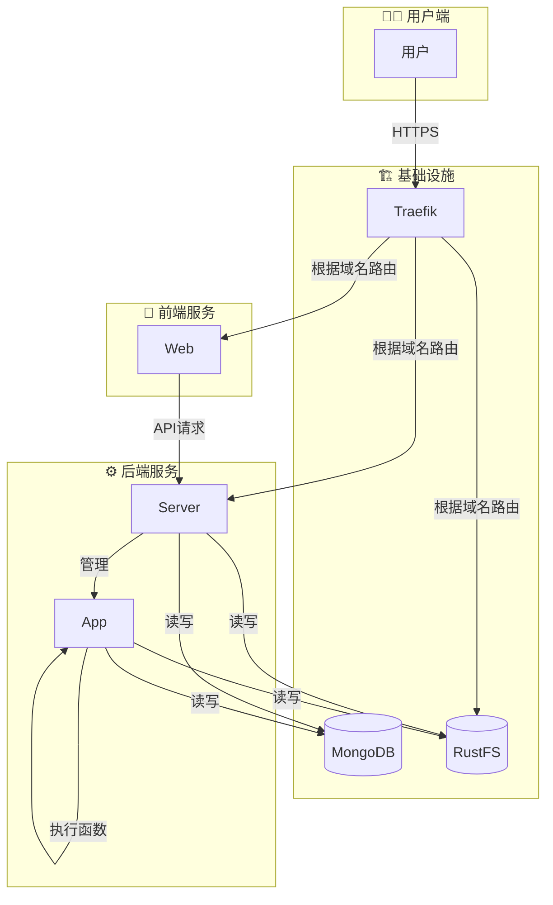

# Hyac - 轻量级Python云函数（Faas）平台

<p align="right">
  <a href="./README.en.md">English</a>
</p>

<div align="center">
  
</div>

> [!WARNING]
> **当前项目处于早期开发阶段**
>
> - 功能和 API 可能会发生较大变化。
> - 直接部署用于生产环境可能会存在未知的风险和问题。
> - 项目架构在后期可能会进行调整和重构。
>
> 欢迎提供反馈和贡献，但请谨慎用于生产环境。

## 🖼️ 预览

<div align="center">
  
</div>

[](LICENSE)

## 📖 介绍

**Hyac** 是一个功能强大的全栈函数即服务 (FaaS) 平台，旨在提供一个高效、可扩展且易于使用的云原生开发环境。它允许开发者快速部署、管理和执行无服务器函数，极大地简化了从开发到生产的流程。


## 🌐 在线访问

- **项目体验地址**: https://console.hyacos.top
  - 默认用户名: `admin`, 默认密码: `admin123`
- **项目文档地址**: https://docs.hyacos.top
## ✨ 主要功能

- 🚀 **动态函数执行**: 在隔离的 Docker 容器中动态加载和执行函数代码。
- 🔥 **代码热更新**: 无需重启服务即可实现函数代码的实时更新。
- 🌐 **多语言支持**: 基于运行时的可扩展性，未来可以支持多种编程语言。
- 💻 **现代化前端**: 基于 Vue 3 和 Naive UI 构建，提供响应式、用户友好的管理界面。
- 📦 **统一对象存储**: 集成 RustFS/S3 兼容对象存储，为函数和应用提供统一的文件存储服务。
- 🔗 **全面的 API**: 提供丰富的 API，用于管理应用、函数、数据库、日志等。

## 🏛️ 系统架构

Hyac 采用基于 Docker Compose 的微服务架构，各组件协同工作，形成一个高效的 FaaS 生态系统。


```mermaid
graph TD
    subgraph "👨‍💻 用户端"
        U[用户]
    end

    subgraph "🏗️ 基础设施"
        T[Traefik]
        DB[(MongoDB)]
        S[(RustFS)]
    end

    subgraph "⚙️ 后端服务"
        Server[Server]
        App[App]
    end

    subgraph "🎨 前端服务"
        Web[Web]
    end

    U -- HTTPS --> T
    T -- 根据域名路由 --> Server
    T -- 根据域名路由 --> Web
    T -- 根据域名路由 --> S
    
    Server -- 管理 --> App
    Server -- 读写 --> DB
    Server -- 读写 --> S
    
    App -- 执行函数 --> App
    App -- 读写 --> DB
    App -- 读写 --> S

    Web -- API请求 --> Server
```

- **`traefik`**: 作为反向代理和负载均衡器，处理所有外部请求，并根据域名自动路由到 `server`、`web` 或 S3 兼容对象存储服务。
- **`server`**: 核心后端服务，负责业务逻辑、API 路由、用户认证和 FaaS 应用管理。
- **`app`**: 函数执行器服务，在隔离的环境中动态执行用户定义的函数。
- **`web`**: 基于 Vue 3 的前端应用，提供用户交互界面。
- **`mongodb`**: 作为主数据库，存储应用、函数、用户等核心数据。
- **`rustfs`**: 提供 S3 兼容对象存储，例如存放函数代码、依赖或其他文件。

## 🛠️ 技术栈

- **后端**: Python 3.10+, FastAPI, Beanie (Motor), Loguru
- **前端**: Vue.js 3, Vite, Naive UI, Pinia, UnoCSS, TypeScript
- **数据库与存储**: MongoDB, RustFS(S3 兼容)
- **容器化**: Docker, Docker Compose

## 🚀 快速开始

### ✅ 环境准备

- [Docker](https://www.docker.com/get-started)
- [Docker Compose](https://docs.docker.com/compose/install/)

### ⚙️ 安装与配置

1.  克隆项目到本地:
    ```bash
    git clone https://github.com/your-repo/hyac.git
    cd hyac
    ```

2.  配置环境变量:
    复制 `.env.example` 文件并重命名为 `.env`，然后根据您的环境修改其中的配置。

### ▶️ 启动服务

执行以下命令以构建和启动所有服务：

```bash
docker-compose up -d
```

### 🌐 访问地址

- **前端应用**: `http://console.[yourdomain]`

### 🔐 开发环境 HTTPS 调试（localhost + mkcert，无需 hosts）

在 `docker-compose.dev.yml` 中，Traefik 使用本地 TLS（不走 `certresolver`），用于避免调试时频繁触发 Let's Encrypt 限流。

> 推荐开发域名固定为 `localhost`，并使用 `mkcert` 本地受信任证书，这样新增 `xxx.localhost` 子域名时无需编辑 `hosts`。

建议流程：

1. 准备开发环境变量文件（推荐与生产分离）：

```bash
cp .env .env.dev
# 将 .env.dev 中 DOMAIN_NAME 改为 localhost
```

2. 安装并初始化 `mkcert`（只需一次）：

```bash
mkcert -install
```

3. 生成开发证书（放到 `./traefik/certs/`）：

```bash
mkdir -p traefik/certs
mkcert -cert-file traefik/certs/dev-cert.pem -key-file traefik/certs/dev-key.pem \
  localhost "*.localhost"
```

4. 启动开发环境（显式使用 `.env.dev`）：

```bash
docker compose --env-file .env.dev -f docker-compose.dev.yml up -d
```

5. 通过以下域名访问并调试：
- `https://console.localhost`
- `https://server.localhost`
- `https://oss.localhost`

说明：
- 开发环境 Traefik 默认读取 `traefik/dynamic-dev/tls.yml`，使用 `traefik/certs/dev-cert.pem` 与 `dev-key.pem` 作为开发证书。
- 生产环境 (`docker-compose.yml`) 继续使用 `.env` 中真实域名与 ACME 自动证书签发策略，不应设置为 `localhost`。

## 📁 主要项目结构

```
.
├── app/            # 函数执行器服务
├── server/         # 核心后端服务
├── web/            # 前端应用 (Vue 3)
├── docker-compose.yml # Docker Compose 配置
├── ...
├── ...
├── ...
└── .env            # 环境变量
```

## 📈 Star 历史

[](https://star-history.com/#Pidbid/Hyac&Date)


## 📜 更新日志

- [简体中文](./changelog/CHANGELOG.zh-CN.md)
- [English](./changelog/CHANGELOG.md)

## ️ 路线图 (Roadmap)

我们计划在未来的版本中加入更多强大的功能，以构建一个更完整、更企业级的 FaaS 平台。

关于详细的未来功能、架构增强和改进计划，请参阅我们的 [功能路线图 (FEATURES.md)](./FEATURES.md)。欢迎社区贡献或提出建议！

## 🤝 贡献指南

我们欢迎任何形式的贡献！如果您有好的想法或发现了问题，请随时提交 Pull Request 或 Issue。

## 📄 开源许可

本项目基于 [MIT License](LICENSE) 开源。
