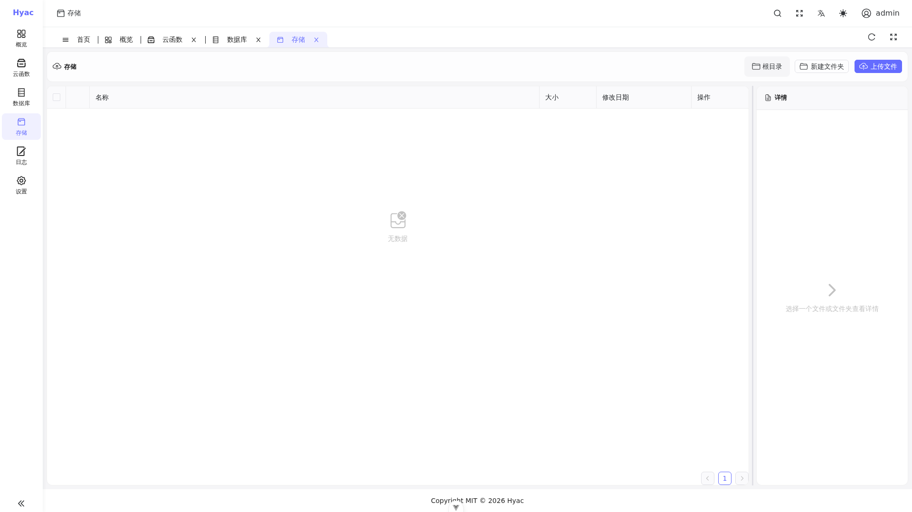

# Object Storage Connection

Hyac uses RustFS as S3-compatible object storage. FaaS functions should access the current application's bucket through `ctx.cloud.storage()`, so function code does not need to manage RustFS access keys directly. The legacy `ctx.s3` entry remains compatible.



The "Storage" page displays files in the current application's bucket. Function `ctx.cloud.storage()` reads and writes the same application storage.

Common use cases include:

- Reading application files
- Writing files generated by functions
- Managing temporary or persistent object data

Example:

```python
async def handler(ctx):
    storage = ctx.cloud.storage()
    data = await storage.get("demo/hello.txt")
    if data is None:
        return {"ok": False, "message": "file not found or read failed"}

    return {"ok": True, "content": data.decode("utf-8")}
```

To write an object:

```python
async def handler(ctx):
    storage = ctx.cloud.storage()
    ok = await storage.put("demo/hello.txt", "Hello from Hyac".encode("utf-8"))
    if not ok:
        return {"ok": False, "message": "write failed"}

    return {"ok": True}
```

`put()` returns `False` when the write fails, and `get()` returns `None` when the read fails or the object does not exist.

The backing storage service is RustFS, while the API remains S3-compatible, so configuration keys still use the `S3_*` prefix.
