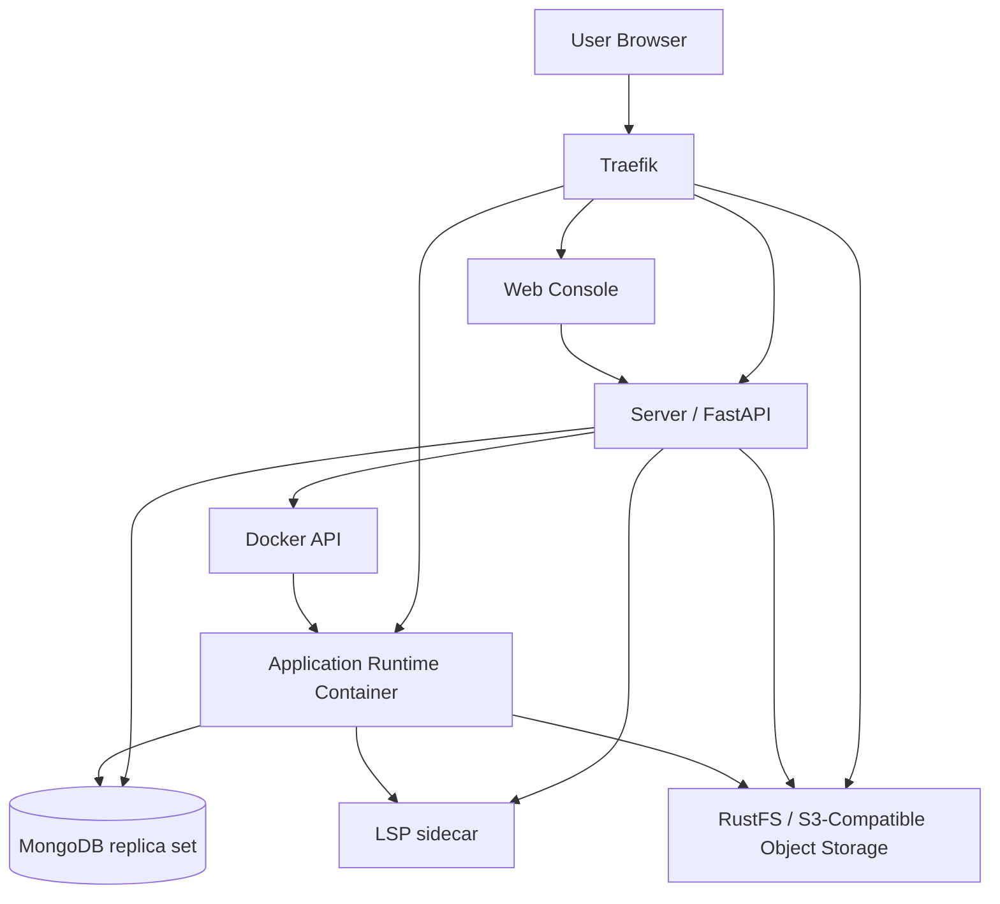

# Architecture

Hyac is deployed with Docker Compose. The main components are Traefik, Web console, Server, MongoDB, RustFS, application runtime image, and LSP sidecar.



## Entry Routing

Traefik is the external traffic entry point.

- `https://console.<DOMAIN_NAME>` opens the Web console.
- `https://server.<DOMAIN_NAME>` reaches Server.
- `https://oss.<DOMAIN_NAME>` reaches RustFS/S3-compatible object storage.
- `https://<app_id>.<DOMAIN_NAME>/<function_id>` invokes an application function.

Production uses `docker-compose.yml` and ACME certificates. Development uses `docker-compose.dev.yml`, `.env.dev`, and local TLS certificates.

## Web Console

The Web console is built with Vue 3, Vite, Naive UI, and TypeScript. Users manage applications, functions, database, object storage, logs, and settings through the console.

## Server

Server is a FastAPI service responsible for:

- Authentication and permission checks.
- Application, function, template, setting, log, and statistics management.
- MongoDB reads and writes.
- RustFS/S3-compatible object storage management.
- Creating and managing application runtime containers through Docker API.
- Forwarding LSP requests for the online editor.

On startup, Server initializes the database, default resources, application image, task worker, and dynamic scheduler.

## MongoDB

MongoDB runs as a replica set. Hyac stores users, applications, functions, statistics, logs, settings, captchas, and other platform data in it.

Each application also has its own database account and database name. Runtime functions access the current application database through `ctx.db` or `ctx.sync_db`.

## RustFS Object Storage

RustFS provides S3-compatible object storage. The Object Storage page and function `ctx.s3` calls use the same application bucket.

## Application Runtime Container

Application functions do not run inside the Server process. On the first request to an application, Server starts a dedicated runtime container through Docker API:

```text
hyac-app-runtime-<lowercase_app_id>
```

The runtime container loads the current application's function code, common functions, environment variables, dependencies, database connection, and object storage context. After the container is healthy, Traefik and Server route application requests to port `8001` in the container.

## LSP Sidecar

The LSP sidecar provides Python language service for the online editor. In development, sidecar mode is enabled by default, and Server/runtime forward editor LSP requests to `hyac_lsp_sidecar:9002`.
