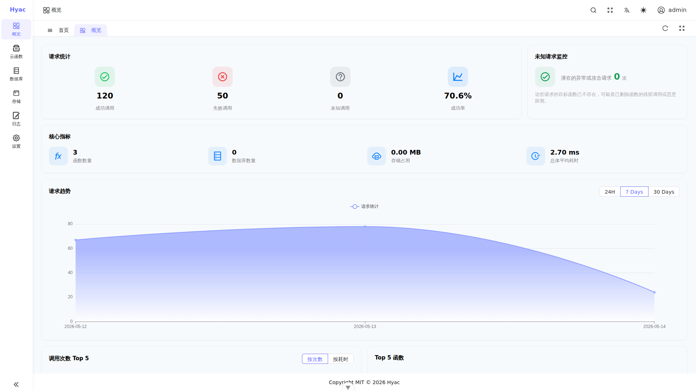

# What is Hyac?

`Hyac` is a private, deployable Function as a Service (FaaS) platform specifically designed for Python. It allows you to deploy Python functions as independently callable API services, just like you would with a cloud provider's product, but with complete control on your own servers.

Hyac aims to solve the pain points in deploying Python web services, such as complex environment configurations, rigid code update processes, and high server idle costs. With `Hyac`, you can focus on developing your core business logic and leave the tedious work of deployment, operations, and scaling to us. Whether you need to quickly implement an API, handle asynchronous tasks, or build a complex microservice, `Hyac` provides you with an extremely agile and highly flexible solution.

The console provides entries for applications, functions, database, object storage, logs, and settings. The screenshot shows the overview page of a running application, which is useful for checking request volume, success rate, and unknown requests.
