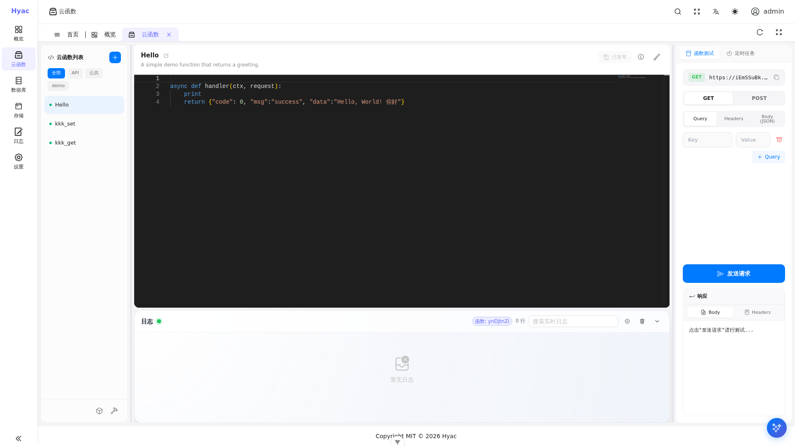

# Function Management

Function Management is the main workspace for writing, testing, publishing, and debugging functions. Hyac currently targets Python functions, and function code runs inside the application's dedicated Docker runtime container.



The page uses a three-column layout: function list on the left, code editor and live logs in the middle, and function test/scheduled task panels on the right.

## Function Types

Common function types include:

- Endpoint functions: externally callable business entry points.
- Common functions: reusable code modules that cannot be called directly from outside.

The external endpoint format is:

```text
https://<app_id>.<DOMAIN_NAME>/<function_id>
```

## Create a Function

Open "Function Management", select the current application, and create a function.

Recommended fields:

- Function name: a human-readable name for the list.
- Function ID: the stable path used in requests.
- Function type: endpoint function or common function.
- Description and tags: useful for filtering and handover.
- Function code: must contain an entry function.

Endpoint functions commonly use `async def handler(ctx, request)`:

```python
async def handler(ctx, request):
    return {"code": 0, "msg": "success", "data": {"app": ctx.app_id}}
```

`ctx` is the runtime context injected by Hyac. It contains database, object storage, environment variables, common functions, notifications, and logging. New functions should use the stable `ctx.cloud` facade to access these resources. Legacy entries such as `ctx.db`, `ctx.s3`, `ctx.env`, `ctx.logger`, and `ctx.common` remain compatible.

Common entries:

| Capability | Recommended entry | Compatible entry |
|------------|-------------------|------------------|
| Async database | `ctx.cloud.database()` | `ctx.db`, `ctx.async_db` |
| Sync database | `ctx.cloud.database(sync=True)` | `ctx.sync_db`, `ctx.pymongo_db` |
| Object storage | `ctx.cloud.storage()` | `ctx.s3` |
| Environment variables | `ctx.cloud.env()` | `ctx.env` |
| Logging | `ctx.cloud.logger()` | `ctx.logger` |
| Notifications | `ctx.cloud.notification()` | `ctx.notification` |
| Common functions | `ctx.cloud.common()` | `ctx.common` |

## Edit and Save

The function detail page has the function list on the left, the code editor in the middle, and test/task panels on the right.

After editing code, save it. The runtime watches code changes and loads the latest function code in most cases without restarting the whole system.

If dependencies or runtime state changed, restart the current application runtime before testing. Environment variables are loaded dynamically by the runtime watcher and do not require a restart.

## Invoke and Test

During development, use the function test panel first. It sends a function call and displays the response.

For external integration, use the standard domain:

```bash
curl -X POST "https://<app_id>.<DOMAIN_NAME>/<function_id>"
```

In development, common addresses are:

```text
https://console.localhost
https://server.localhost
https://<app_id>.localhost/<function_id>
```

## Logs

The log area in the function detail page shows live output from the current application's runtime container. Live logs come from Docker runtime stdout/stderr, while historical records come from saved function invocation data.

For debugging, check both console logs and container logs:

```bash
docker logs -f hyac-app-runtime-<lowercase_app_id>
```

In function code:

```python
async def handler(ctx, request):
    logger = ctx.cloud.logger()
    logger.info("function started")
    return {"ok": True}
```

## Dependencies

Applications can configure Python dependencies. The runtime container installs the application's dependencies when it starts.

Recommendations:

- Prefer explicit package names and versions.
- After adding dependencies, restart the current application runtime if it is already running.
- Avoid installing dependencies dynamically during function execution.

## Environment Variables

Application environment variables are injected into the runtime process. Functions should read or update them through `ctx.cloud.env()`:

```python
async def handler(ctx, request):
    env = ctx.cloud.env()
    api_key = env.get("API_KEY")
    return {"configured": bool(api_key)}
```

Update an environment variable:

```python
async def handler(ctx, request):
    env = ctx.cloud.env()
    await env.set("FEATURE_FLAG", "enabled")
    return {"ok": True}
```

Environment variables are application-level configuration. Do not mix secrets across applications or environments.

After environment variables are updated from the console or function code, the current application runtime refreshes them dynamically without a restart.

## Common Functions

Common functions are suitable for reusable logic such as signature validation, data transformation, or third-party service wrappers.

Example common function `math_utils`:

```python
def add(a, b):
    return a + b
```

Call it from an endpoint function:

```python
async def handler(ctx, request):
    common = ctx.cloud.common()
    value = common.math_utils.add(1, 2)
    return {"value": value}
```

## Scheduled Tasks

The function page includes scheduled task controls. They are useful for periodic work such as data sync, temporary file cleanup, and report generation.

Before creating a schedule, make sure the function passes a manual test. If a scheduled task fails, check function logs and runtime container logs first.

## History

Function history helps you review code changes. Before changing important functions, confirm the current version is saved and add a clear description.

If a new version fails, use the history as a reference to restore code.

## AI Assistant

The editor may include an AI assistant. AI-generated code still needs review and testing, especially for database writes, external requests, secrets, and error handling.

## FAQ

### The old logic still runs after saving

Confirm that the save succeeded, then check whether the runtime has loaded the latest code. Restart the current application runtime if needed.

### The log panel has no output

Confirm that the function actually ran. Live logs come from the runtime container; if the container is not started or the function is not triggered, there is no live output.

### External calls return 404

Check `app_id`, `DOMAIN_NAME`, and `function_id`. Both the application subdomain and function path must be correct.
