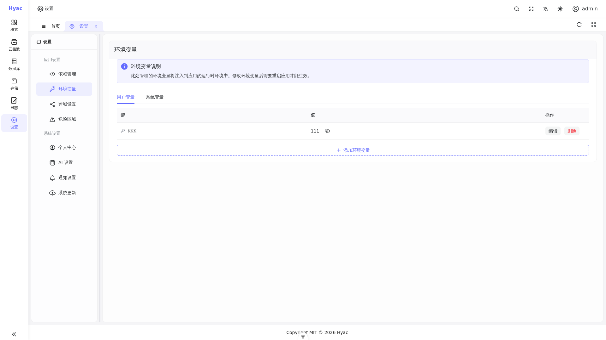

# 在函数内使用环境变量

在 Hyac 中，您可以通过 `context.env` 对象来动态地读取和设置特定于该函数实例的环境变量。这对于管理配置、密钥或其他运行时需要的数据非常有用。



控制台“设置 / 环境变量”页用于管理应用级环境变量。运行时会监听环境变量变更并动态更新进程环境，不需要重启应用运行时。

通过代码调用 `ctx.env.set(...)` 会更新持久化配置，并立即更新当前运行时进程的 `os.environ`。通过控制台修改环境变量后，运行时的环境变量监听器会接收 MongoDB Change Stream 事件并动态刷新 `os.environ`。

## 1. 获取环境变量

您可以使用 `context.env.get("VARIABLE_NAME")` 方法来获取一个环境变量的值。

```python
async def handler(context):
    """
    一个演示如何获取环境变量的函数。
    """
    # 获取名为 'API_KEY' 的环境变量
    api_key = context.env.get("API_KEY")

    if not api_key:
        return {"error": "API_KEY not configured."}

    return {"message": f"Successfully retrieved API_KEY: {api_key[:4]}****"}
```

## 2. 设置环境变量

您可以使用 `await context.env.set("VARIABLE_NAME", "VALUE")` 方法来设置或更新一个环境变量。这是一个异步操作。

**重要提示**: 通过此方法设置的环境变量是持久化的，它会覆盖在管理后台设置的同名变量，并在当前运行时中立即可读。

```python
async def handler(context):
    """
    一个演示如何设置环境变量的函数。
    """
    new_api_key = "a-new-secret-key-generated-at-runtime"
    
    # 设置或更新名为 'API_KEY' 的环境变量
    await context.env.set("API_KEY", new_api_key)
    
    return {"message": "API_KEY has been updated successfully."}
```

通过结合使用 `get` 和 `set` 方法，您可以实现动态配置管理、状态持久化等高级功能，而无需担心因配置变更而中断服务。
