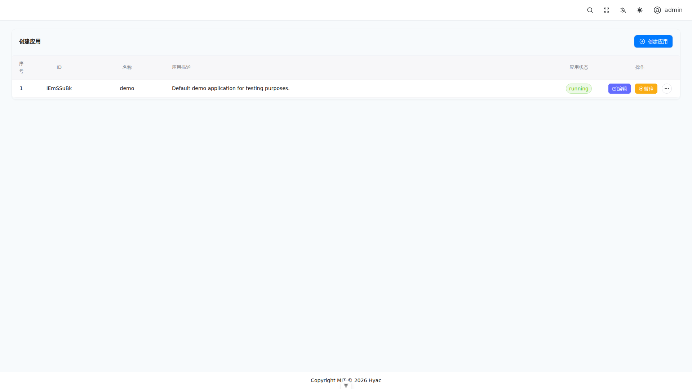

# 部署

本指南将引导您完成在您自己的服务器上部署 Hyac 的过程。

## 先决条件

- 一台安装了 Docker 和 Docker Compose 的服务器。
- 一个域名。

## 1. 克隆仓库

```bash
git clone https://github.com/Pidbid/Hyac.git
cd Hyac
```

## 2. 配置环境变量

有关环境变量的更多详细信息，请参阅[开发环境](../development/dev-environment.md)文档。

将 `.env.example` 文件复制为 `.env`。

```bash
cp .env.example .env
```

启动前必须替换 `.env` 中的全部占位值。生产环境必填项包括：

-   `DOMAIN_NAME`、`EMAIL_ADDRESS`
-   `MONGODB_USERNAME`、`MONGODB_PASSWORD`
-   `S3_ACCESS_KEY`、`S3_SECRET_KEY`
-   `SECRET_KEY`（至少 32 个字符）
-   `DEFAULT_ADMIN_USER`、`DEFAULT_ADMIN_PASSWORD`
-   `APP_IMAGE_TAG`（不可变的发布标签，例如 `v1.2.3`，禁止使用 `latest`）

`openssl rand -hex 32` 会生成前后端管理员密码字段均支持的 64 位十六进制值。请为每个密码或密钥分别生成不同的随机值。生产配置中不得保留 `.env.example` 的任何 `<...>` 占位符。

**重要提示：** 为了让函数能够通过唯一的子域名进行访问，您需要在您的域名服务商处添加一条泛解析（Wildcard）记录。具体操作如下：

-   **记录类型**: `A`
-   **主机记录**: `*`
-   **记录值**: 指向您服务器的 IP 地址

## 3. 生成 MongoDB Keyfile

首次启动生产环境前，先执行仓库脚本：

```bash
./scripts/01-create-mongo-keyfile.sh
```

只有当脚本确认权限为 `0400` 且所有者为 MongoDB 容器用户后，才能继续。如果当前用户无法设置正确所有者，请使用足够权限重新运行脚本，不要让 MongoDB 使用不可读的 keyfile 启动。

## 4. 启动服务

```bash
docker compose up -d
```

这将在后台启动所有必需的服务。

## 5. 访问系统

现在，您可以通过以下地址访问 Hyac 控制台：

- `https://console.your-domain.name` 
-- 如 官方测试地址为：`https://console.hyacos.top`



首次登录后会进入应用列表。确认默认应用或新建应用处于 `running` 状态后，就可以进入应用工作台创建函数。
