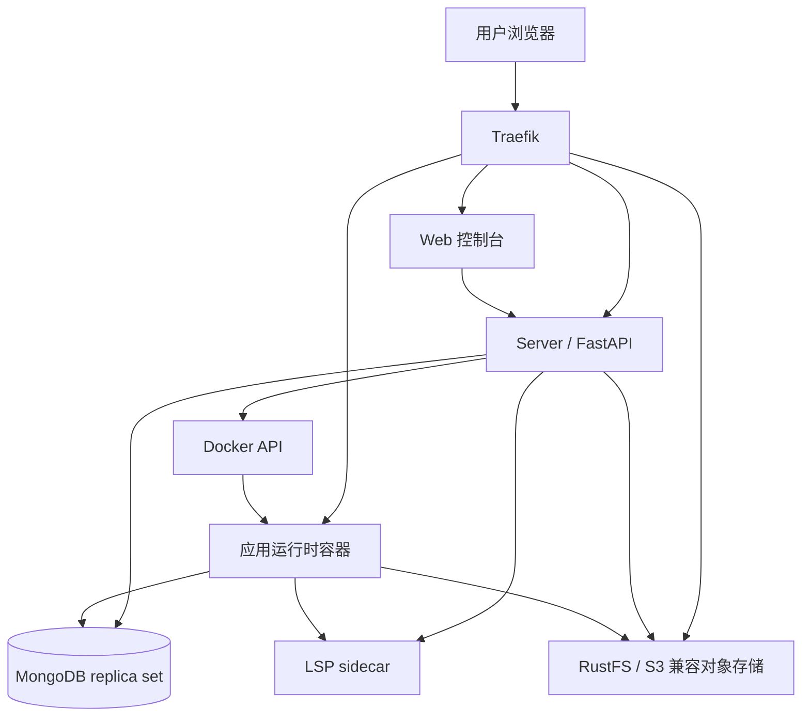

# 架构

Hyac 采用 Docker Compose 部署，核心组件包括 Traefik、Web 控制台、Server、MongoDB、RustFS、应用运行时镜像和 LSP sidecar。



## 入口路由

Traefik 是外部流量入口。

- `https://console.<DOMAIN_NAME>` 访问 Web 控制台。
- `https://server.<DOMAIN_NAME>` 访问 Server。
- `https://oss.<DOMAIN_NAME>` 访问 RustFS/S3 兼容对象存储。
- `https://<app_id>.<DOMAIN_NAME>/<function_id>` 调用应用函数。

生产环境使用 `docker-compose.yml` 和 ACME 自动证书。开发环境使用 `docker-compose.dev.yml`、`.env.dev` 和本地 TLS 证书。

## Web 控制台

Web 控制台基于 Vue 3、Vite、Naive UI 和 TypeScript。用户通过控制台管理应用、函数、数据库、对象存储、日志和设置。

## Server

Server 是 FastAPI 服务，负责：

- 用户认证和权限校验。
- 应用、函数、模板、设置、日志、统计等管理能力。
- MongoDB 数据读写。
- RustFS/S3 兼容对象存储管理。
- 通过 Docker API 创建和管理应用运行时容器。
- 为在线编辑器转发 LSP 请求。

Server 启动时会初始化数据库、默认资源、应用镜像、任务 worker 和动态调度器。

## MongoDB

MongoDB 以 replica set 模式运行。Hyac 使用它保存用户、应用、函数、统计、日志、设置和验证码等平台数据。

每个应用也会拥有自己的数据库账号和数据库名。函数运行时推荐通过 `ctx.cloud.database()` 访问当前应用异步数据库，通过 `ctx.cloud.database(sync=True)` 访问同步数据库；`ctx.db`、`ctx.sync_db` 等旧入口仍保持兼容。

## RustFS 对象存储

RustFS 提供 S3 兼容对象存储。控制台对象存储页和函数中的 `ctx.cloud.storage()` 使用同一份应用 Bucket；`ctx.s3` 仍是兼容入口。

## 应用运行时容器

应用函数不会直接运行在 Server 进程里。第一次访问某个应用时，Server 会通过 Docker API 启动独立运行时容器：

```text
hyac-app-runtime-<app_id小写>
```

运行时容器会加载当前应用的函数代码、公共函数、环境变量、依赖、数据库连接和对象存储上下文。容器健康后，Traefik 和 Server 会把应用请求转发到容器的 `8001` 端口。

## LSP sidecar

LSP sidecar 为在线代码编辑器提供 Python 语言服务。开发环境默认通过 sidecar 模式连接，Server 和应用运行时会把编辑器 LSP 请求转发到 `hyac_lsp_sidecar:9002`。
