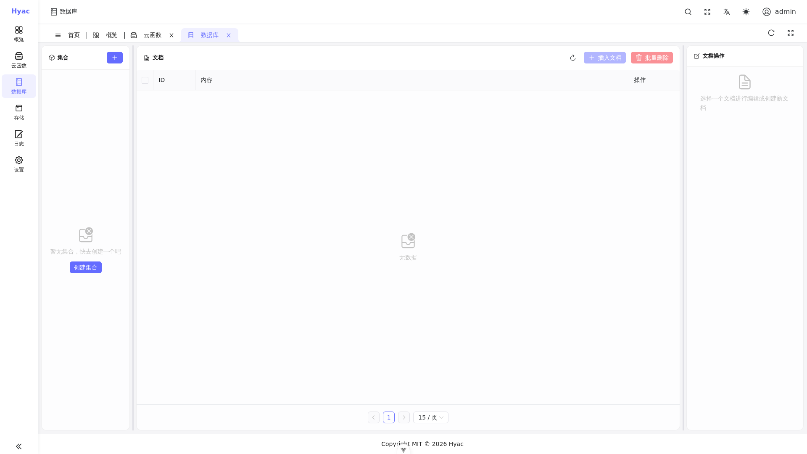

# 数据库访问

Hyac 为每个应用提供独立的 MongoDB 数据库。函数运行时会根据当前应用自动注入数据库连接，函数代码不需要自己拼接 MongoDB 连接字符串。

当前版本不再使用 Motor。用户代码应使用 PyMongo 提供的异步或同步客户端。



数据库页面用于查看和管理当前应用数据库中的集合与文档。函数代码访问数据库时使用同一个应用上下文。

## 推荐方式：异步 PyMongo

推荐使用 `ctx.db` 访问当前应用的异步数据库。它来自 `pymongo.AsyncMongoClient`，适合绝大多数函数。

```python
async def handler(ctx, request):
    collection = ctx.db["todos"]

    result = await collection.insert_one({
        "title": "Write Hyac docs",
        "done": False
    })

    document = await collection.find_one({"_id": result.inserted_id})

    return {
        "id": str(result.inserted_id),
        "title": document["title"],
        "done": document["done"]
    }
```

常用操作：

```python
async def handler(ctx, request):
    users = ctx.db["users"]

    await users.insert_one({"name": "Alice"})
    one = await users.find_one({"name": "Alice"})
    await users.update_one({"name": "Alice"}, {"$set": {"active": True}})

    rows = []
    async for item in users.find({"active": True}).limit(10):
        item["_id"] = str(item["_id"])
        rows.append(item)

    return {"one": str(one["_id"]), "rows": rows}
```

## 同步方式：`ctx.sync_db`

如果你使用的第三方库或代码逻辑暂时只能同步执行，可以通过 `ctx.sync_db` 获取同步 PyMongo 数据库。

```python
async def handler(ctx, request):
    collection = ctx.sync_db["events"]
    result = collection.insert_one({"type": "login"})
    return {"id": str(result.inserted_id)}
```

同步数据库操作会阻塞当前执行线程。高并发函数应优先使用 `ctx.db`。

## 数据库隔离

每个应用使用自己的数据库账号和数据库名。运行时会按应用加载连接：

```text
mongodb://<app_id>:<db_password>@mongodb:27017/<app_id>?authSource=admin&replicaSet=rs0
```

用户函数通常不需要知道这个连接串。你只需要使用 `ctx.db` 或 `ctx.sync_db`。

## ObjectId 处理

MongoDB 的 `_id` 默认是 `ObjectId`，不能直接作为 JSON 返回。返回前需要转成字符串。

```python
async def handler(ctx, request):
    doc = await ctx.db["items"].find_one({})
    if not doc:
        return None

    doc["_id"] = str(doc["_id"])
    return doc
```

## 错误处理

数据库写入建议显式捕获异常，并返回业务可理解的信息。

```python
from pymongo.errors import PyMongoError

async def handler(ctx, request):
    try:
        await ctx.db["orders"].insert_one({"status": "created"})
        return {"ok": True}
    except PyMongoError as exc:
        ctx.logger.error(f"database write failed: {exc}")
        return {"ok": False, "message": "database write failed"}
```

## 迁移提示

旧文档和旧函数中可能出现 `ctx.motor_db` 或 `context.motor_db`。当前代码中它只是兼容别名，不再作为推荐用法。

建议替换为：

```python
db = ctx.db
```

同步代码使用：

```python
db = ctx.sync_db
```

## 使用建议

- 不要在函数中硬编码 MongoDB 管理员账号。
- 不要跨应用读写其他应用数据库。
- 高并发请求优先使用 `ctx.db`。
- 返回文档前处理 `_id`、`datetime` 等非 JSON 原生类型。
- 删除和批量更新前先明确查询条件，避免误操作。
