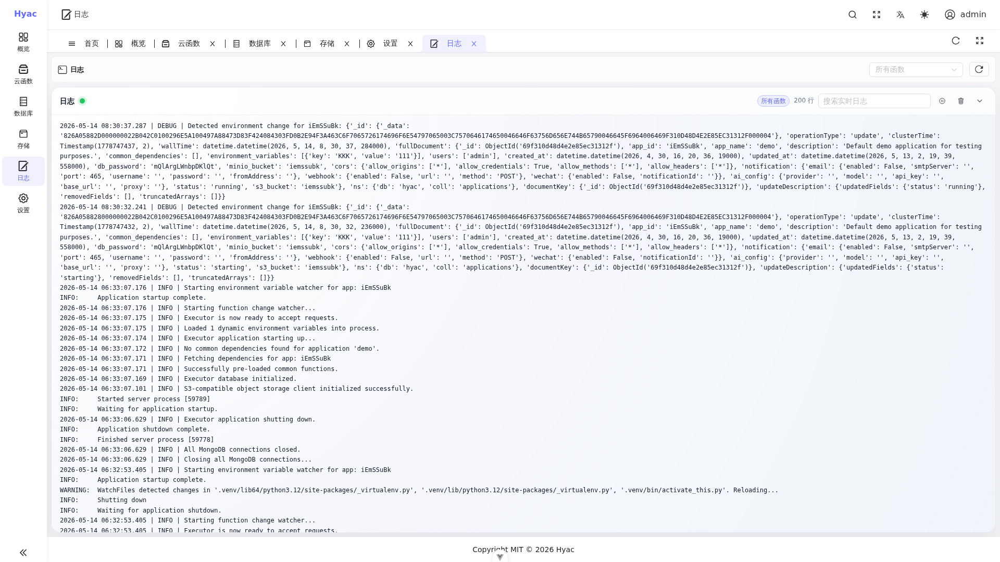

# 日志

日志页用于查看当前应用运行时容器的实时输出。它适合排查函数执行、环境变量刷新、依赖加载、LSP 连接和运行时异常。



## 日志来源

Hyac 的实时日志来自应用运行时容器的 stdout/stderr。容器名通常为：

```text
hyac-app-runtime-<app_id小写>
```

这意味着日志页看到的是函数真实执行进程输出，而不是单纯的前端缓存。

## 页面结构

日志页包含：

- 函数筛选：可以查看所有函数，也可以只看某个函数。
- 连接状态：显示实时日志连接是否正常。
- 日志行数：显示当前保留的日志数量。
- 搜索框：用于在当前日志内容中查找关键字。
- 操作按钮：用于刷新、暂停、清空或控制实时日志显示。

## 函数中输出日志

函数内推荐使用 `ctx.cloud.logger()` 输出日志。旧入口 `ctx.logger` 仍保持兼容：

```python
async def handler(ctx, request):
    logger = ctx.cloud.logger()
    logger.info("start handling request")
    return {"ok": True}
```

也可以使用标准输出。实时日志会从 Docker runtime 输出流中读取。

## 和函数管理页日志的关系

函数管理页中的日志面板更适合边写代码边测试；独立日志页更适合持续观察整个应用。

如果只排查某个函数，建议在日志页选择该函数或在函数管理页查看对应日志。

## 容器侧排查

当日志页无法连接或没有输出时，可以直接查看容器：

```bash
docker logs -f hyac-app-runtime-<app_id小写>
```

开发环境中，也可以查看 Server 和 LSP sidecar：

```bash
docker logs -f hyac_server
docker logs -f hyac_lsp_sidecar
```

## 常见问题

### 日志页显示实时连接，但没有新日志

确认函数是否真的被调用。实时日志只会显示运行时容器产生的新输出。

### 日志里出现大量环境变量变更

这通常表示应用配置发生了更新，运行时监听到了 MongoDB Change Stream 事件。只要函数执行正常，一般不需要处理。

### 函数报错但页面响应仍是 200

Hyac 的业务错误可能以 JSON 响应返回。排查时同时查看函数响应体和日志堆栈。
