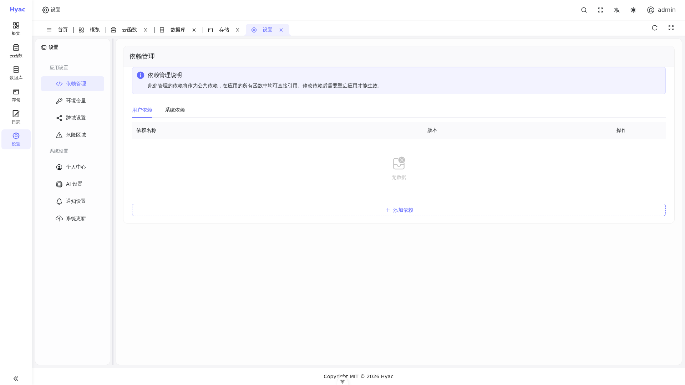

# 用户设置

用户设置用于管理账号、安全信息和系统级偏好。不同部署版本和权限配置下，可见项目可能不同。



设置页包含依赖管理、环境变量、跨域设置、危险区域、个人中心、AI 设置、通知设置和系统更新等入口。不同权限和版本下可见内容可能不同。

## 登录账号

首次部署后，默认管理员账号来自环境变量：

```text
DEFAULT_ADMIN_USER
DEFAULT_ADMIN_PASSWORD
```

示例环境变量有意将密码留空：

```text
DEFAULT_ADMIN_USER=admin
DEFAULT_ADMIN_PASSWORD=
```

首次启动前必须设置强管理员密码并妥善保存凭据；生产启动会拒绝空密码或弱密码。

## 密码和安全

建议：

- 不要使用空密码或弱管理员密码启动生产环境。
- 管理员账号只分配给需要维护平台的人。
- 定期轮换 `SECRET_KEY` 相关敏感配置前，先评估现有登录态和令牌影响。
- 不要把 `.env` 文件提交到公开仓库。

## 应用权限

应用、函数、数据库和对象存储都围绕应用归属管理。用户只能看到自己有权限的应用。

如果用户看不到某个应用，优先检查：

- 用户是否已经登录正确账号。
- 应用是否包含该用户。
- 当前页面是否选择了正确应用。

## 系统配置

部署级配置主要来自 `.env`、`.env.dev` 和 Docker Compose。

常见配置包括：

- `DOMAIN_NAME`：控制 `console`、`server`、`oss` 和应用子域名。
- `EMAIL_ADDRESS`：生产环境 ACME 证书申请邮箱。
- `S3_ACCESS_KEY` / `S3_SECRET_KEY`：RustFS 初始访问凭据。
- `SECRET_KEY`：JWT 和其他安全能力使用的密钥。
- `DEMO_MODE`：演示模式开关。
- `LSP_MODE`：在线编辑器语言服务模式。

修改部署级环境变量后，通常需要重启相关容器。

## 开发环境和生产环境

生产环境使用：

```bash
docker compose up -d
```

开发环境建议使用：

```bash
docker compose --env-file .env.dev -f docker-compose.dev.yml up -d
```

开发环境默认使用 `localhost` 和本地证书，避免触发公网证书申请限制。生产环境应使用真实域名和 `docker-compose.yml`。

## 运行时排查

用户设置和系统配置问题常常表现为登录失败、应用无法访问、对象存储不可用或函数运行时启动失败。

常用检查命令：

```bash
docker compose --env-file .env.dev -f docker-compose.dev.yml ps
docker logs -f hyac_server
docker logs -f hyac_web
docker logs -f hyac_lsp_sidecar
docker logs -f hyac-app-runtime-<app_id小写>
```

如果是生产环境，将命令中的 `--env-file .env.dev -f docker-compose.dev.yml` 替换为生产 Compose 配置。
